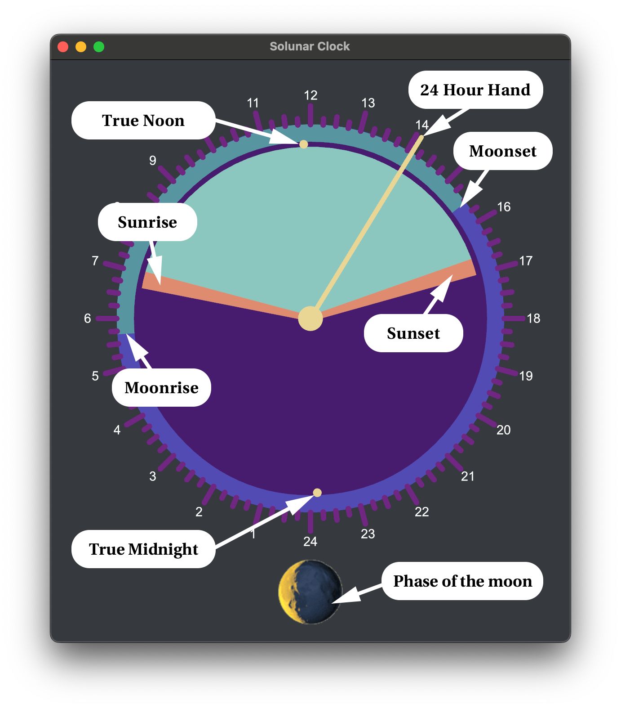

# Solunar Clock
A solar/lunar clock built with [Iced](https://github.com/iced-rs/iced).



To use, change the latitute and longitude variables in `main.rs` to your coordinates (Note that degrees to the West is negative).

```rust
let _latitude: f64 = 34.0522;
let _longitude: f64 = -118.2437;
```

Then run with `cargo run --release`